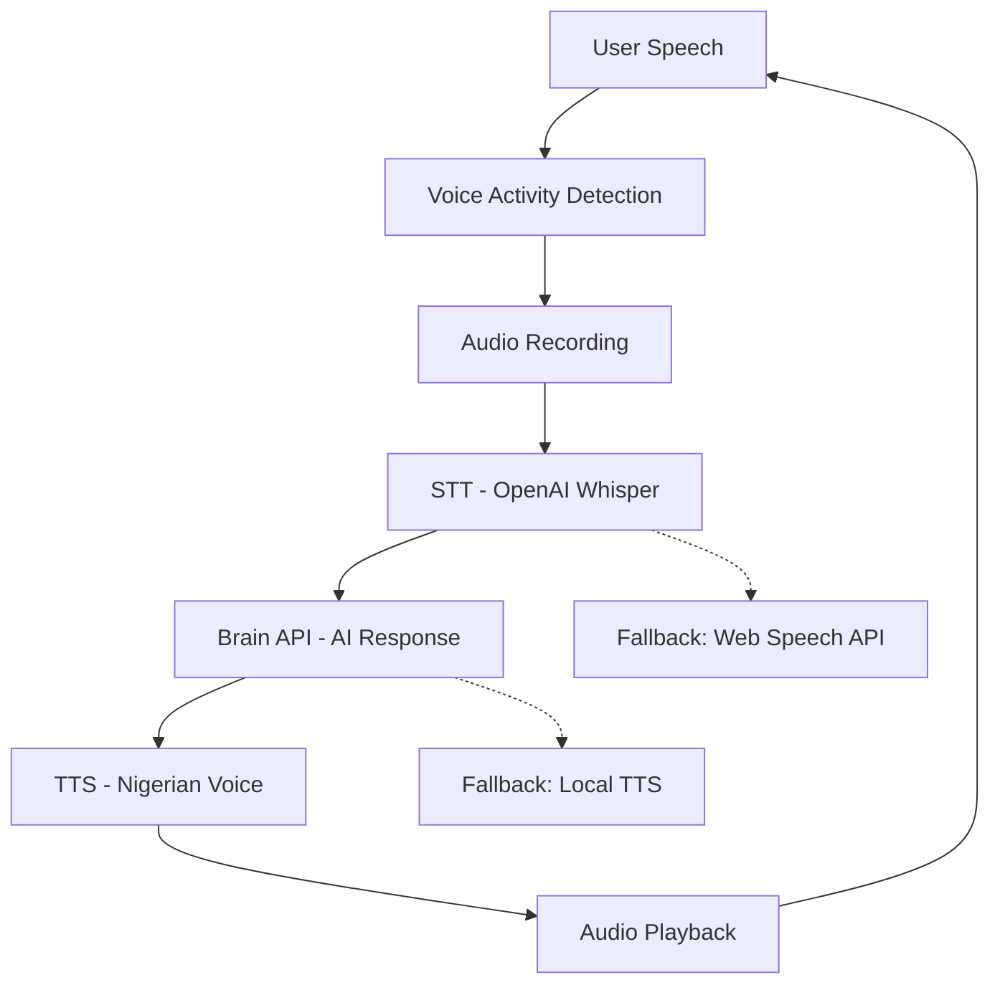

# Adaqua AI Voice Assistant

**Voice-first Conversational AI powered by ODIADEV**

A production-ready, hands-free voice assistant that provides continuous listening, automatic speech detection, and natural conversation flow using Nigerian TTS.

## 🎯 Features

- **Continuous Listening**: No button pressing required - just speak naturally
- **Voice Activity Detection (VAD)**: Automatically detects when you start and stop speaking
- **Hands-free Loop**: Listen → STT → AI Response → TTS → Repeat
- **Nigerian Male Voice**: Authentic `naija_male_warm` TTS via ODIADEV Brain API
- **Multiple Fallbacks**: OpenAI Whisper → Web Speech API → Local TTS
- **Real-time UI**: Floating bubble with animated voice wave indicators
- **Production-ready**: Error handling, retry logic, accessibility support

## 🏗️ Architecture



## 🚀 Quick Start

### 1. Environment Setup

Create `.env.local` with your OpenAI API key:

```bash
# Server-side (required for STT)
OPENAI_API_KEY=your_openai_api_key_here

# Public (frontend configuration)
NEXT_PUBLIC_BRAIN_CHAT_AUDIO_URL=https://brain-api.odia.dev/v1/chat-audio
NEXT_PUBLIC_DEFAULT_VOICE=naija_male_warm
NEXT_PUBLIC_AUDIO_FORMAT=mp3
NEXT_PUBLIC_VAD_SILENCE_MS=800
NEXT_PUBLIC_VAD_MIN_UTTER_MS=500
NEXT_PUBLIC_MAX_UTTER_SEC=20
OPENAI_STT_MODEL=whisper-1
```

### 2. Install & Run

```bash
npm install
npm run dev
# Open http://localhost:3000
```

### 3. First Use

1. **Grant Permissions**: Click the floating bubble to grant microphone access
2. **Start Talking**: Speak naturally - the assistant will detect your voice
3. **Automatic Response**: Wait for silence detection, then get AI + TTS response
4. **Continuous Flow**: The cycle continues hands-free

## 🎮 User Interface

### Floating Bubble States

| State | Color | Animation | Meaning |
|-------|-------|-----------|----------|
| Idle | Gray | Static | Tap to start |
| Listening | Green | Pulse | Recording your voice |
| Thinking | Blue | Ping | Processing speech → AI |
| Speaking | Purple | Bounce | Playing AI response |
| Error | Red | Flash | Issue occurred, retrying |

### Voice Activity Detection

- **Speech Threshold**: RMS energy > 0.04 (adjustable)
- **Minimum Utterance**: 500ms of speech required
- **Silence Detection**: 800ms of silence finalizes utterance
- **Maximum Length**: 20 seconds auto-cutoff

## 🧪 Testing & Acceptance Criteria

### Manual Testing Checklist

#### ✅ Basic Functionality
- [ ] **Cold Start**: Single click → mic permission → "Listening…" status
- [ ] **Voice Detection**: Speak for 3 seconds → detects speech activity
- [ ] **Response Time**: Complete cycle ≤ 2.5 seconds (speech → response)
- [ ] **Audio Quality**: Clear Nigerian male voice playback
- [ ] **Continuous Loop**: 5+ conversation turns without manual intervention

#### ✅ Error Handling
- [ ] **Network Recovery**: Disable network mid-speech → auto-reconnect
- [ ] **STT Fallback**: Force `/api/transcribe` failure → Web Speech API kicks in
- [ ] **Multiple Retries**: Verify exponential backoff on failures
- [ ] **Graceful Degradation**: All fallbacks work independently

#### ✅ Browser Compatibility
- [ ] **Chrome/Edge**: Full functionality including VAD
- [ ] **Firefox**: Core features with fallbacks
- [ ] **Mobile Safari**: Autoplay compliance + touch activation
- [ ] **Permissions**: Graceful mic access denial handling

#### ✅ Performance
- [ ] **Low CPU**: VAD runs without blocking UI
- [ ] **Memory Management**: No audio context leaks
- [ ] **Audio Cleanup**: Proper stream disposal on stop

### Automated Tests

```bash
# Run unit tests (when implemented)
npm test

# Check TypeScript compilation
npm run build

# Lint code quality
npm run lint
```

## 🔧 API Endpoints

### `/api/transcribe` (STT Proxy)

**Request:**
```http
POST /api/transcribe
Content-Type: audio/webm

[Binary audio data]
```

**Response:**
```json
{
  "text": "Your transcribed speech"
}
```

**Error Response:**
```json
{
  "error": "stt_upstream_failed",
  "details": "OpenAI API error details"
}
```

### External: Brain Chat-Audio

**Request:**
```http
POST https://brain-api.odia.dev/v1/chat-audio
Content-Type: application/json

{
  "text": "User's speech",
  "voice_id": "naija_male_warm",
  "format": "mp3"
}
```

**Response:** Binary MP3 audio data

## 🚀 Deployment

### Vercel (Recommended)

```bash
npm i -g vercel
vercel

# Set environment variables
vercel env add OPENAI_API_KEY
vercel env add NEXT_PUBLIC_BRAIN_CHAT_AUDIO_URL

# Deploy production
vercel --prod
```

### Environment Variables (Production)

| Variable | Required | Description |
|----------|----------|-------------|
| `OPENAI_API_KEY` | ✅ | OpenAI API key for Whisper STT |
| `NEXT_PUBLIC_BRAIN_CHAT_AUDIO_URL` | ✅ | Brain API endpoint |
| `NEXT_PUBLIC_DEFAULT_VOICE` | ⚪ | TTS voice ID (default: naija_male_warm) |
| `NEXT_PUBLIC_VAD_SILENCE_MS` | ⚪ | Silence detection threshold (default: 800) |

### Custom Domain Setup

1. **CORS Configuration**: Ensure Brain API allows your domain
2. **HTTPS Required**: Microphone access requires secure context
3. **CDN Optimization**: Enable for static assets, exclude API routes

## 🛠️ Development

### Project Structure

```
├── app/
│   ├── layout.tsx          # Root layout with metadata
│   ├── page.tsx            # Main UI with VoiceAssistant
│   └── api/chat-audio/     # Legacy text-to-speech proxy
├── pages/api/
│   └── transcribe.ts       # STT proxy (OpenAI Whisper)
├── components/
│   └── VoiceAssistant.tsx  # Main voice component
├── .env.local              # Environment variables
└── README.md               # This file
```

### Key Technologies

- **Framework**: Next.js 14 (App Router + Pages API)
- **Audio**: Web Audio API, MediaRecorder, AudioContext
- **STT**: OpenAI Whisper API (serverless proxy)
- **TTS**: ODIADEV Brain API (Nigerian voice)
- **UI**: React with Tailwind CSS
- **Fallbacks**: Web Speech API, Speech Synthesis API

### Configuration Tuning

```javascript
// Adjust VAD sensitivity
NEXT_PUBLIC_VAD_SILENCE_MS=600    // More responsive
NEXT_PUBLIC_VAD_SILENCE_MS=1200   // Less sensitive

// Utterance length limits
NEXT_PUBLIC_VAD_MIN_UTTER_MS=300  // Shorter minimum
NEXT_PUBLIC_MAX_UTTER_SEC=30      // Longer maximum
```

## 🔍 Troubleshooting

### Common Issues

**"Microphone access denied"**
- Ensure HTTPS (required for mic access)
- Check browser permissions settings
- Try incognito mode to reset permissions

**"STT API failed"**
- Verify `OPENAI_API_KEY` is set correctly
- Check OpenAI account has sufficient credits
- Monitor `/api/transcribe` endpoint logs

**"Audio won't play"**
- Browser autoplay policy - ensure user gesture first
- Check audio codec support (MP3)
- Verify Brain API is returning valid audio

**"VAD not detecting speech"**
- Check microphone input levels
- Adjust `VAD_SILENCE_MS` threshold
- Enable microphone in browser settings

### Debug Mode

```javascript
// Enable console logging
const DEBUG = true;
if (DEBUG) console.log('VAD energy:', rms);
```

## 📄 License

Built by ODIADEV - Production voice AI systems

For support: Contact ODIADEV team

---

**Ready to deploy?** Make sure your OpenAI API key is configured and start building the future of voice AI! 🎙️